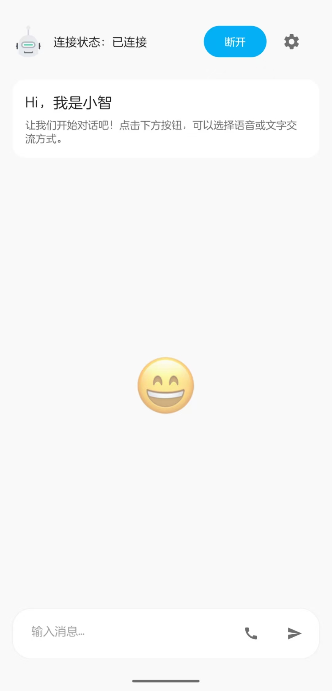

# 小智AI助手 Android客户端

一个基于WebSocket的Android语音对话应用,支持实时语音交互和文字对话。

<p align="center">
  
</p>

[查看演示视频](https://m.bilibili.com/video/BV19QPHeHEJm?buvid=XU9C15B983E5B3201C25FDE381B1F1C4C33D5&from_spmid=dt.space-dt.video.0&is_story_h5=false&mid=5zOL0pVwHX2%2BpSNDC91few%3D%3D&p=1&plat_id=114&share_from=ugc&share_medium=android&share_plat=android&share_session_id=8f4e8fb2-fbc5-41ad-b488-fdbb2423aed4&share_source=WEIXIN&share_tag=s_i&spmid=united.player-video-detail.0.0&timestamp=1740629989&unique_k=CR9irtn&up_id=1145920831)

## 功能特点

- 实时语音电话对话
- 多服务地址添加
- 文字消息交互
- 波形动画显示
- 支持Opus音频编解码
- 支持Token认证
- 支持自定义MAC
- 自动重连机制
- 深色/浅色主题适配
- 随时打断，随时说话

## 系统要求

- Android 11.0 (API 30)及以上
- 需要麦克风权限
- 需要网络连接

## 构建说明

1. 克隆项目:
```bash
git clone https://github.com/TOM88812/xiaozhi-android-client.git
```

2. 使用Android Studio打开项目

3. 构建项目:
   - 点击 Build -> Build Bundle(s) / APK(s) -> Build APK(s)
   - 或在命令行执行: `./gradlew assembleDebug`

4. 编译输出:
   - Debug APK位置: `app/build/outputs/apk/debug/app-debug.apk`
   - Release APK位置: `app/build/outputs/apk/release/app-release.apk`

## 配置说明

1. 服务器配置
   - 在设置页面配置WebSocket服务器地址
   - 默认地址: `ws://localhost:9005`

2. Token认证
   - 可选择是否启用Token认证
   - 在设置页面配置Token

3. 自定义MAC
   - Android ID生成的MAC，或者自定义MAC
   - 在设置页面配置MAC
## 技术栈

- WebSocket: Java-WebSocket 1.5.4
- 音频编解码: Opus

## 开发环境

- Android Studio
- JDK 17

## 已知问题

- 接收到end后，还会有tts音频数据传输，导致麦克风收音提前启动，监听到AI回复的内容，导致自言自语。
目前还是会监听ai回复的最后一句话，请你最好在ai说话的时候点击闭麦。

## Star History

[](https://star-history.com/#TOM88812/xiaozhi-android-client&Date)
