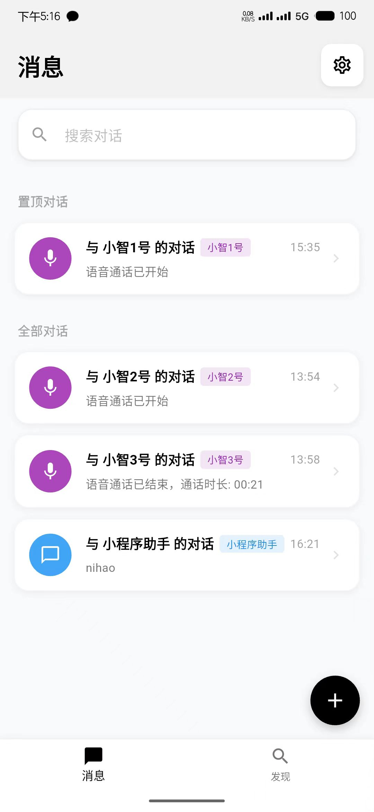

# 小智AI助手 Android IOS 客户端

> 目前已经发布新版本，敬请体验！flutter IOS端回音消除未实现，欢迎大家PR。
> 觉得项目对您有用的，可以赞赏一下，您的每一次赞赏都是我前进的动力。
> Dify支持发送图片交互。可以添加多个小智到聊天列表，需要连接虾哥官方的需要先有注册过的设备MAC地址。

一个基于WebSocket的Android语音对话应用,支持实时语音交互和文字对话。
基于Flutter框架开发的小智AI助手，支持多平台（iOS、Android、Web、Windows、macOS、Linux）部署，提供实时语音交互和文字对话功能。

<table>
  <tr>
    <td align="center" valign="bottom" height="500">
      <table>
        <tr>
          <td align="center">
            <a href="https://www.bilibili.com/video/BV1fgXvYqE61" target="_blank">
              
            </a>
          </td>
        </tr>
        <tr>
          <td align="center">
            <small>
  新版IOS、安卓端（可以自行打包WEB、PC版本)<br>
  <a href="https://www.bilibili.com/video/BV1fgXvYqE61" style="color: red; text-decoration: none;">观看demo视频点击跳转</a>
</small>
          </td>
        </tr>
      </table>
    </td>
  </tr>
</table>

## 功能特点

- **跨平台支持**：使用Flutter框架，一套代码支持多平台
- **多AI模型支持**：
  - 集成小智AI服务（WebSocket实时语音对话）
  - 支持Dify
  - 支持OpenAI-图文消息-流式输出（已完成）
  - 支持官方小智-一键添加设备注册（已完成）
- **丰富的交互方式**：
  - 支持实时语音通话（持续对话）
  - 支持文字消息交互
  - 支持图片消息
  - 支持通话手动打断
  - 支持按住说话
- **多样化界面**：
  - 深色/浅色主题适配 （暂无适配）
  - 轻度拟物化
  - 自适应UI布局
  - 精美动画效果
- **系统功能**：
  - 多种AI服务配置管理
  - 自动重连机制
  - 语音/文字会话混合历史
  - 实现安卓 AEC+NS 回音消除

## 系统要求

- **Flutter**: ^3.7.0
- **Dart**: ^3.7.0
- **iOS**: 12.0+
- **Android**: API 21+ (Android 5.0+)
- **Web**: 现代浏览器支持

## 安装与构建

1. 克隆项目:
```bash
git clone https://github.com/TOM88812/xiaozhi-android-client.git
```

2. 安装依赖:
```bash
flutter pub get
```

3. 运行应用:
```bash
flutter run
```

4. 构建发布版本:
```bash
# Android
flutter build apk --release

# iOS
flutter build ios --release

# Web
flutter build web --release
```

5. 如果没有证书:
安卓无影响。
IOS、Mac可以按照无签名的方法打包，使用第三方工具侧载。
IOS编译完后，需要在设置-APP中打开网络权限

## 配置说明

### 小智服务配置
- 支持配置多个小智服务地址
- WebSocket URL设置
- Token认证
- 自定义MAC

### Dify API配置
- 支持配置多个Dify服务
- API密钥管理
- 服务器URL配置


## 开发计划
- [ ] 深色/浅色主题适配
- [x] 支持更多AI服务提供商
- [x] 增强语音识别准确性
- [x] 支持OTA自动注册设备
- [ ] 支持Iot映射手机操作
- [ ] 支持本地asr语音识别
- [ ] 支持本地唤醒词
- [ ] 支持TTS
- [ ] 支持MCP_Client
- [ ] 支持OpenAI接口联网搜索🔍


## 🌟支持

您的每一个start⭐或赞赏💖，都是我们不断前进的动力🛸。
<div style="display: flex;">

</div>

## Star History

[](https://star-history.com/#TOM88812/xiaozhi-android-client&Date)
